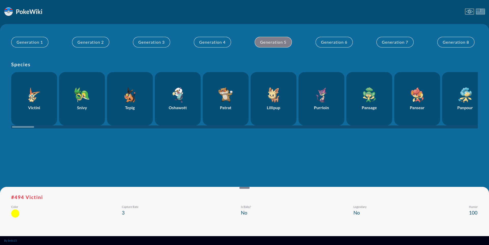
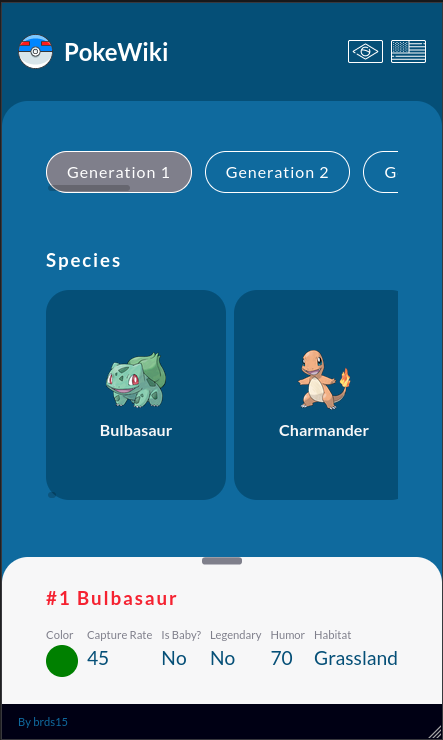

# PokeWiki 

Is a React app to show overview of each Pokemon generations

É uma aplicação React que mostra um pouco sobre cada geração de Pokemon




## Getting started / Para começar
Execute these below commands / Execute os seguintes comandos

```sh
git clone git@github.com:brds15/pokewiki.git
cd pokewiki 
yarn install # to install dependencies
yarn start # open localhost:3000
```

## Credits / Creditos

[PokeAPI](https://pokeapi.co/) - used to get data / usado para obter as infromações

[Pokeres](https://pokeres.bastionbot.org/) - used to get pokemons images / usado para obter as imagens dos pokemons

## Diary of developing / Diário do desenvolvimento

- Definir e criar o layout do zero é sempre um desafio hehe

- Decidi usar a i18next para o i18n. Pois a que usava lib muito bem otimizada com o react. Mas não consegui linkar ela a tempo com o translate da API

- Percebi que seria mais interessante mudar o content grid de dinamico para fixo. Pois assim, da uma cara de PWA.

- Procurei na documentação da PokeAPI qual request trás a imagem do pokemon. Mas descobri que teria que pegar isso em outro local. Foi ai que descobri a Pokeres. Mas não consegui a tempo, aplicar o loading quando a categoria é mudada, pois teria que fazer requisição por callback uma por uma para não pesar no carregamento.

- Havia criado um GET para resgatar os pokemons, por meio de uma função recebia um generationId. Mas vi que não fazia muito sentido, pois o response da api já tem a url completa para requisição. Portanto, criei uma função generica de requisição. Com isso o acoplamento diminui e deixou a requisição mais coesa.

## To future / Para o futuro
- Add filters
- Apply for another languages
- Use API for i18n
- Add skeleton loader
- Use cache features
- Add loader spinner
- Show default image when error
- Make each request image using callback
- Make detail resized
